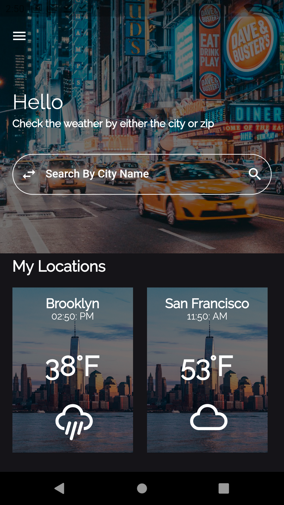
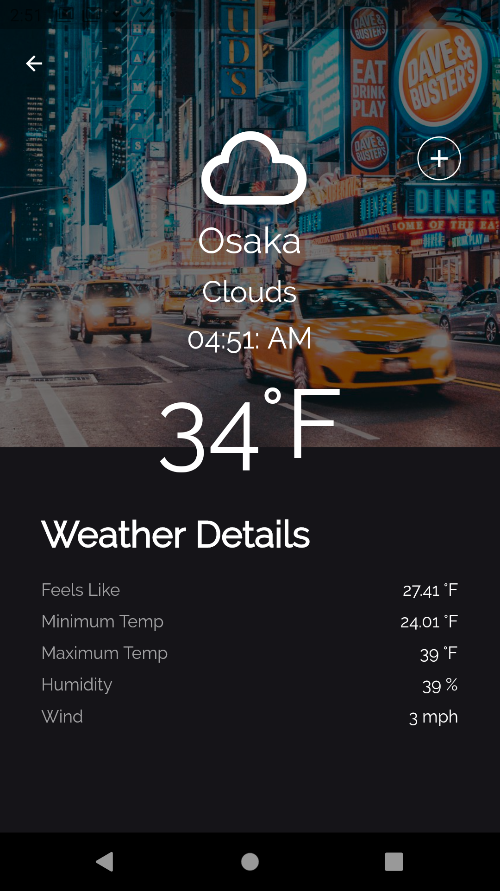

* UI Concept from - https://dribbble.com/shots/14562207--22-Weather-Forecast-App-MobileApp-Concept
* Google Play Link - https://play.google.com/store/apps/details?id=com.patrickchow.weather_app

# Weather Now

Weather Now is an app built with the Flutter Framework. The app is used to find out the weather location anywhere. Users can add as many locations as they want to be saved for easy access. Users can also view the current time of any city.

•Incorperated Firebase Auth and Firebase Firestore to keep track of users ' saved locations. 

•Made all of the API calls to obtain weather information. Also, incorporated geolocator to find the current user's weather data. 

  
Packages Used-  
[Provider](https://pub.dev/packages/provider) 
[Http](https://pub.dev/packages/http) 
[Geolocator](https://pub.dev/packages/geolocator) 
[Intl](https://pub.dev/packages/intl) 
[Firebase Core](https://pub.dev/packages/firebase_core) 
[Firebase Auth](https://pub.dev/packages/firebase_auth) 
[Firebase Firestore](https://pub.dev/packages/cloud_firestore) 
[rFlutter Alert](https://pub.dev/packages/rflutter_alert) 
[Cached Network Image](https://pub.dev/packages/cached_network_image) 
[DotEnv](https://pub.dev/packages/flutter_dotenv) 
[Lint](https://pub.dev/packages/lint) 
[Weather Icons](https://pub.dev/packages/weather_icons) 
